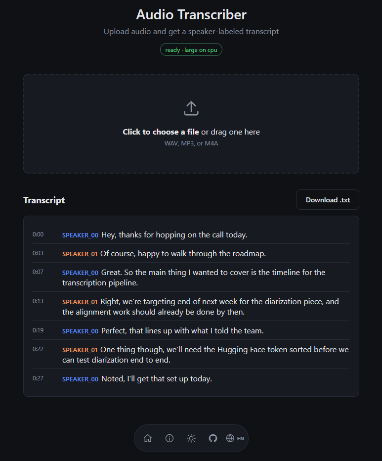
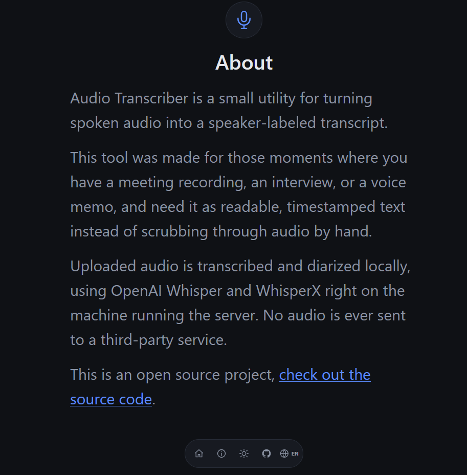

# Audio Transcriber

A small Flask app that transcribes an audio file and labels each segment with
the speaker who said it, using [OpenAI Whisper](https://github.com/openai/whisper)
for transcription and [WhisperX](https://github.com/m-bain/whisperX) +
[pyannote](https://github.com/pyannote/pyannote-audio) for alignment and
speaker diarization.




## Features

- Drag-and-drop web UI for uploading WAV, MP3, or M4A files
- Speaker-labeled, timestamped transcript rendered in the browser
- Downloadable `.txt` transcript
- GPU acceleration (CUDA) when available, falls back to CPU

## Requirements

- Python 3.11
- A [Hugging Face](https://huggingface.co/settings/tokens) account and access
  token, with the terms accepted on
  [pyannote/speaker-diarization](https://huggingface.co/pyannote/speaker-diarization)
- (Optional) an NVIDIA GPU with CUDA for faster transcription

## Setup

```bash
python -m venv venv
source venv/bin/activate   # venv\Scripts\activate on Windows

pip install --no-build-isolation -r requirements.txt

cp .env.example .env       # then edit .env and add your HF_TOKEN
```

`--no-build-isolation` is required because `openai-whisper`'s legacy setup script
needs `pkg_resources` at build time, which pip's isolated build environments
don't provide unless `setuptools<81` (pinned in `requirements.txt`) is already
installed in your venv first.

## Running

```bash
python app.py
```

The app starts on `http://localhost:5000` by default. Open it in a browser,
upload an audio file, and click **Transcribe**.

## Configuration

All settings are read from environment variables (see `.env.example`):

| Variable        | Description                                             | Default |
|-----------------|----------------------------------------------------------|---------|
| `HF_TOKEN`       | Hugging Face token, required for speaker diarization     | —       |
| `WHISPER_MODEL`  | Whisper model size (`tiny`, `base`, `small`, `medium`, `large`) | `large` |
| `DEVICE`         | `cuda` or `cpu`                                          | auto-detected |
| `MAX_UPLOAD_MB`  | Max upload size in MB                                    | `200`   |
| `FLASK_HOST`     | Bind address                                              | `0.0.0.0` |
| `FLASK_PORT`     | Bind port                                                  | `5000`  |
| `FLASK_DEBUG`    | Enable Flask debug mode                                   | `false` |

If `HF_TOKEN` is not set, the server still starts and transcribes audio, but
speaker diarization is disabled and upload requests will fail with an error
explaining that a token is needed.

## Project structure

```
app.py               Flask app: routes, transcription, diarization
templates/index.html Web UI markup
static/style.css      Web UI styling
static/script.js      Web UI upload/render logic
uploads/               Uploaded audio (gitignored)
output/                 Generated transcripts (gitignored)
```

## API

- `GET /api/health` — model/device status and whether diarization is enabled
- `POST /api/upload` — multipart form upload with a `file` field; returns the
  transcript as JSON and the name of the saved `.txt` file
- `GET /api/download/<filename>` — download a generated transcript

## Deployment

A GitHub Actions workflow (`.github/workflows/master_audiotranscriber.yml`)
deploys this app to Azure App Service on pushes to `master`. Set `HF_TOKEN`
and the other environment variables above as App Service configuration
settings rather than committing a `.env` file.
